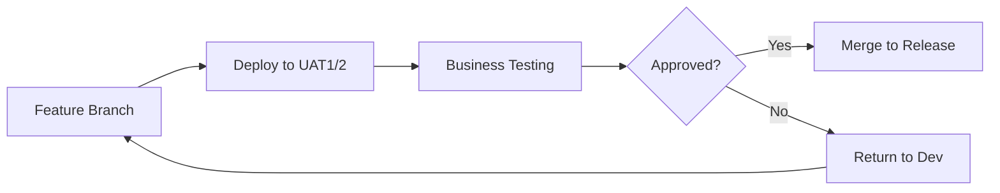
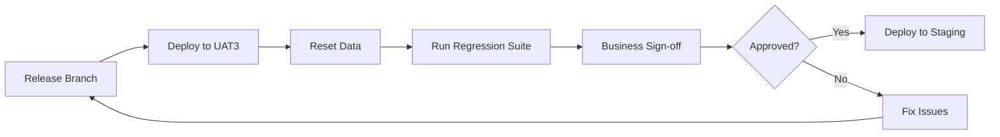

# UAT Environments

User Acceptance Testing (UAT) environments provide isolated spaces for business stakeholders to validate features before production deployment.

## Overview

QuikApp maintains three UAT environments for different testing purposes:

| Environment | URL | Purpose |
|-------------|-----|---------|
| **UAT1** | `https://uat1.QuikApp.com` | Feature testing (Sprint A) |
| **UAT2** | `https://uat2.QuikApp.com` | Feature testing (Sprint B) |
| **UAT3** | `https://uat3.QuikApp.com` | Regression testing |

## Environment Details

### Common Configuration

| Aspect | Configuration |
|--------|---------------|
| **Data** | Sanitized production data |
| **Deployment** | Manual / On-demand |
| **Access** | Business users, QA team, Product team |
| **Replicas** | 2 per service |

### UAT1 - Feature Testing A

```
Primary Use: Testing features from current sprint
Branch: feature/* branches ready for UAT
Deployment: Manual by development team
Reset: On-demand
```

### UAT2 - Feature Testing B

```
Primary Use: Testing features from parallel sprint
Branch: feature/* branches ready for UAT
Deployment: Manual by development team
Reset: On-demand
```

### UAT3 - Regression Testing

```
Primary Use: Full regression before release
Branch: release/* branches
Deployment: Scheduled before each release
Reset: Before each release cycle
```

## Infrastructure

```
┌─────────────────────────────────────────────────────────────────────────────┐
│                           AWS - UAT Account                                  │
│                                                                              │
│  ┌─────────────────────┐ ┌─────────────────────┐ ┌─────────────────────┐   │
│  │    EKS (UAT1)       │ │    EKS (UAT2)       │ │    EKS (UAT3)       │   │
│  │  ┌─────┐ ┌─────┐   │ │  ┌─────┐ ┌─────┐   │ │  ┌─────┐ ┌─────┐   │   │
│  │  │ BE  │ │Auth │...│ │  │ BE  │ │Auth │...│ │  │ BE  │ │Auth │...│   │
│  │  │ x2  │ │ x2  │   │ │  │ x2  │ │ x2  │   │ │  │ x2  │ │ x2  │   │   │
│  │  └─────┘ └─────┘   │ │  └─────┘ └─────┘   │ │  └─────┘ └─────┘   │   │
│  └─────────────────────┘ └─────────────────────┘ └─────────────────────┘   │
│            │                      │                      │                  │
│  ┌─────────────────┐   ┌─────────────────┐   ┌─────────────────┐          │
│  │   RDS (UAT1)    │   │   RDS (UAT2)    │   │   RDS (UAT3)    │          │
│  │   Dedicated     │   │   Dedicated     │   │   Dedicated     │          │
│  └─────────────────┘   └─────────────────┘   └─────────────────┘          │
│                                                                              │
│  ┌───────────────────────────────────────────────────────────────────┐     │
│  │                     Shared Services                                │     │
│  │  ┌─────────────┐  ┌─────────────┐  ┌─────────────┐               │     │
│  │  │ ElastiCache │  │    MSK      │  │ OpenSearch  │               │     │
│  │  │   Shared    │  │   Shared    │  │   Shared    │               │     │
│  │  └─────────────┘  └─────────────┘  └─────────────┘               │     │
│  └───────────────────────────────────────────────────────────────────┘     │
└─────────────────────────────────────────────────────────────────────────────┘
```

## Kubernetes Configuration

### UAT1 Kustomization

```yaml
# k8s/overlays/uat1/kustomization.yaml
apiVersion: kustomize.config.k8s.io/v1beta1
kind: Kustomization

namespace: QuikApp-uat1

resources:
  - ../../base

replicas:
  - name: backend
    count: 2
  - name: auth-service
    count: 2
  - name: user-service
    count: 2

images:
  - name: registry.QuikApp.dev/backend
    newTag: uat1-latest
  - name: registry.QuikApp.dev/auth-service
    newTag: uat1-latest

configMapGenerator:
  - name: app-config
    behavior: merge
    literals:
      - ENVIRONMENT=uat1
      - LOG_LEVEL=info
      - ENABLE_SWAGGER=false
      - UAT_MODE=true
```

### UAT2 Kustomization

```yaml
# k8s/overlays/uat2/kustomization.yaml
apiVersion: kustomize.config.k8s.io/v1beta1
kind: Kustomization

namespace: QuikApp-uat2

resources:
  - ../../base

replicas:
  - name: backend
    count: 2
  - name: auth-service
    count: 2
  - name: user-service
    count: 2

images:
  - name: registry.QuikApp.dev/backend
    newTag: uat2-latest
  - name: registry.QuikApp.dev/auth-service
    newTag: uat2-latest

configMapGenerator:
  - name: app-config
    behavior: merge
    literals:
      - ENVIRONMENT=uat2
      - LOG_LEVEL=info
      - ENABLE_SWAGGER=false
      - UAT_MODE=true
```

### UAT3 Kustomization

```yaml
# k8s/overlays/uat3/kustomization.yaml
apiVersion: kustomize.config.k8s.io/v1beta1
kind: Kustomization

namespace: QuikApp-uat3

resources:
  - ../../base

replicas:
  - name: backend
    count: 2
  - name: auth-service
    count: 2
  - name: user-service
    count: 2

images:
  - name: registry.QuikApp.dev/backend
    newTag: uat3-latest
  - name: registry.QuikApp.dev/auth-service
    newTag: uat3-latest

configMapGenerator:
  - name: app-config
    behavior: merge
    literals:
      - ENVIRONMENT=uat3
      - LOG_LEVEL=info
      - ENABLE_SWAGGER=false
      - UAT_MODE=true
      - REGRESSION_MODE=true
```

## Deployment Scripts

### Deploy to UAT

```bash
#!/bin/bash
# scripts/deploy-uat.sh

UAT_ENV=$1  # uat1, uat2, or uat3
BRANCH=$2   # Branch or tag to deploy
VERSION=${3:-$(git rev-parse --short HEAD)}

if [[ ! "$UAT_ENV" =~ ^(uat1|uat2|uat3)$ ]]; then
  echo "Usage: ./deploy-uat.sh <uat1|uat2|uat3> <branch> [version]"
  exit 1
fi

echo "Deploying $BRANCH to $UAT_ENV..."

# Build and push images
docker build -t registry.QuikApp.dev/backend:$UAT_ENV-$VERSION ./backend
docker push registry.QuikApp.dev/backend:$UAT_ENV-$VERSION

# Tag as latest for the UAT environment
docker tag registry.QuikApp.dev/backend:$UAT_ENV-$VERSION \
           registry.QuikApp.dev/backend:$UAT_ENV-latest
docker push registry.QuikApp.dev/backend:$UAT_ENV-latest

# Update kubeconfig
aws eks update-kubeconfig --name QuikApp-uat --region us-east-1

# Deploy
kubectl apply -k k8s/overlays/$UAT_ENV
kubectl rollout status deployment/backend -n QuikApp-$UAT_ENV --timeout=300s

echo "Deployment to $UAT_ENV complete!"
echo "URL: https://$UAT_ENV.QuikApp.com"
```

### Reset UAT Data

```bash
#!/bin/bash
# scripts/reset-uat-data.sh

UAT_ENV=$1

if [[ ! "$UAT_ENV" =~ ^(uat1|uat2|uat3)$ ]]; then
  echo "Usage: ./reset-uat-data.sh <uat1|uat2|uat3>"
  exit 1
fi

echo "Resetting data for $UAT_ENV..."

# Scale down services
kubectl scale deployment --all --replicas=0 -n QuikApp-$UAT_ENV

# Restore from sanitized production snapshot
aws rds restore-db-cluster-from-snapshot \
  --db-cluster-identifier QuikApp-$UAT_ENV-new \
  --snapshot-identifier prod-sanitized-latest \
  --engine aurora-postgresql

# Wait for restore
aws rds wait db-cluster-available \
  --db-cluster-identifier QuikApp-$UAT_ENV-new

# Switch to new cluster (update secrets)
kubectl create secret generic db-credentials \
  --from-literal=host=QuikApp-$UAT_ENV-new.cluster-xxxxx.rds.amazonaws.com \
  --dry-run=client -o yaml | kubectl apply -f - -n QuikApp-$UAT_ENV

# Scale up services
kubectl scale deployment --all --replicas=2 -n QuikApp-$UAT_ENV

echo "Data reset complete for $UAT_ENV!"
```

## Data Sanitization

Production data is sanitized before being used in UAT:

```python
# scripts/sanitize_prod_data.py

import hashlib
from faker import Faker

fake = Faker()

def sanitize_user(user):
    """Sanitize user PII while maintaining referential integrity"""
    # Hash email domain to maintain uniqueness
    email_hash = hashlib.md5(user['email'].encode()).hexdigest()[:8]

    return {
        **user,
        'email': f"uat.user.{email_hash}@QuikApp-test.com",
        'display_name': fake.name(),
        'phone': fake.phone_number() if user.get('phone') else None,
        'avatar_url': f"https://api.dicebear.com/7.x/avataaars/svg?seed={email_hash}",
        # Preserve IDs and relationships
        'id': user['id'],
        'workspace_ids': user['workspace_ids'],
    }

def sanitize_message(message):
    """Sanitize message content while preserving structure"""
    return {
        **message,
        'content': fake.sentence() if message['content'] else None,
        # Preserve metadata
        'id': message['id'],
        'channel_id': message['channel_id'],
        'user_id': message['user_id'],
        'created_at': message['created_at'],
    }

def sanitize_file(file):
    """Replace files with placeholders"""
    return {
        **file,
        'url': f"https://cdn.uat.QuikApp.com/placeholder/{file['type']}",
        'name': f"test_file_{file['id']}.{file['extension']}",
    }
```

## UAT Test Users

Each UAT environment has pre-configured test users:

### UAT1 Users

| Email | Password | Role |
|-------|----------|------|
| uat1.admin@QuikApp.com | Uat1Admin123! | Super Admin |
| uat1.owner@QuikApp.com | Uat1Owner123! | Workspace Owner |
| uat1.member@QuikApp.com | Uat1Member123! | Member |
| uat1.guest@QuikApp.com | Uat1Guest123! | Guest |

### UAT2 Users

| Email | Password | Role |
|-------|----------|------|
| uat2.admin@QuikApp.com | Uat2Admin123! | Super Admin |
| uat2.owner@QuikApp.com | Uat2Owner123! | Workspace Owner |
| uat2.member@QuikApp.com | Uat2Member123! | Member |
| uat2.guest@QuikApp.com | Uat2Guest123! | Guest |

### UAT3 Users

| Email | Password | Role |
|-------|----------|------|
| uat3.admin@QuikApp.com | Uat3Admin123! | Super Admin |
| uat3.owner@QuikApp.com | Uat3Owner123! | Workspace Owner |
| uat3.member@QuikApp.com | Uat3Member123! | Member |
| uat3.guest@QuikApp.com | Uat3Guest123! | Guest |

## UAT Workflow

### Feature Testing (UAT1/UAT2)



### Regression Testing (UAT3)



## Monitoring

| Tool | UAT1 | UAT2 | UAT3 |
|------|------|------|------|
| Grafana | [uat1.grafana](https://grafana.uat1.QuikApp.com) | [uat2.grafana](https://grafana.uat2.QuikApp.com) | [uat3.grafana](https://grafana.uat3.QuikApp.com) |
| Logs | [uat1.logs](https://logs.uat1.QuikApp.com) | [uat2.logs](https://logs.uat2.QuikApp.com) | [uat3.logs](https://logs.uat3.QuikApp.com) |

## Accessing UAT Environments

### VPN Connection

```bash
# Connect to UAT VPN (shared across UAT1-3)
openvpn --config QuikApp-uat.ovpn
```

### kubectl Access

```bash
# Configure kubectl for UAT
aws eks update-kubeconfig --name QuikApp-uat --region us-east-1

# Access specific namespace
kubectl get pods -n QuikApp-uat1
kubectl get pods -n QuikApp-uat2
kubectl get pods -n QuikApp-uat3
```

## UAT Sign-off Process

```yaml
# uat-signoff-template.yaml
feature:
  name: "Feature Name"
  jira_ticket: "QUCK-1234"

testing:
  uat_environment: "uat1"
  test_period: "2024-01-15 to 2024-01-19"

stakeholders:
  - name: "Product Owner"
    email: "po@QuikApp.com"
    approved: true
    date: "2024-01-18"
  - name: "Business Analyst"
    email: "ba@QuikApp.com"
    approved: true
    date: "2024-01-19"

test_cases:
  total: 25
  passed: 24
  failed: 0
  blocked: 1

notes: |
  One test case blocked due to missing test data.
  All critical paths tested and approved.

recommendation: "APPROVED for production deployment"
```
